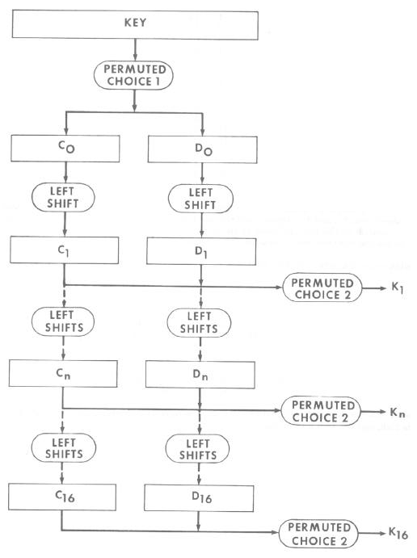
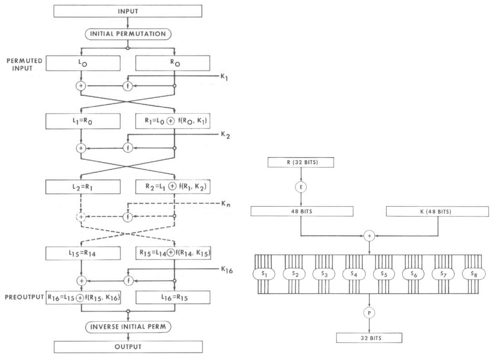
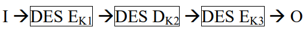
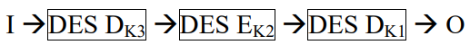

# 3DES-Cryptography

A 3DES implementation in Python.

# Algorithm

### DES

1. Encryption
    1. Create 16 subkeys  
        
    2. Encrypt each 64-bit block of data  
        
    3. Combine those blocks
2. Decryption
    1. Follow the same steps as above, but reverse the order in which the subkeys are applied.

### 3DES

1. Encryption  
    
2. Decryption  
    

# Test Environment

+ Windows 11
+ Python 3.12.0

# References

+ [The DES Algorithm Illustrated](http://page.math.tu-berlin.de/~kant/teaching/hess/krypto-ws2006/des.htm)
+ [FIPS 46-3, Data Encryption Standard (DES)](https://csrc.nist.gov/csrc/media/publications/fips/46/3/archive/1999-10-25/documents/fips46-3.pdf)
+ [What is 3DES encryption and how does DES work?](https://www.comparitech.com/blog/information-security/3des-encryption/)

# License

This project is under the [MIT License](./LICENSE).
